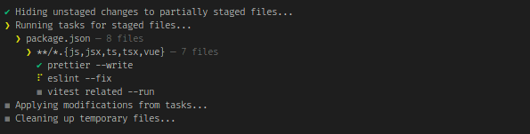
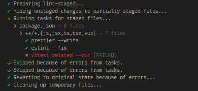
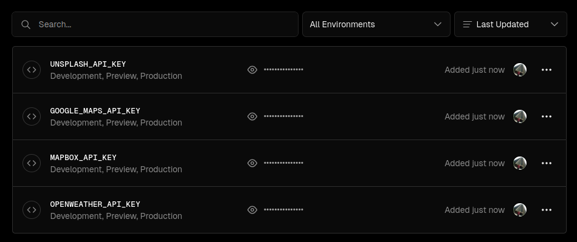

# city-explorer-app

Cities exploration with info about weather, interactive map and images

## Stack:

- 🚀 The webapp uses Vite + Nuxt 3 (SSR) + Vue 3 + Typescript
- 🛠️ App is online on: [city-explorer-wheater](https://city-explorer-wheat.vercel.app/)
- 🛠️ Git hooks are implemented to ensure the product quality. Check CI/CD
- 🔦 Format is being applied with prettier and eslint with their properly confiuration
- 🎨 UI components were implemented using AntDesign. Styles were complemented with Tailwind CSS.
- 🧪 Unit testing were done with vitest

## Architectural / Implementation details:

These are some patterns and good practices that were implemented / choosen in this project:

- Separation of responsibilities: server with api calls, composables to connect client with server side, components, pages.
- The structure of the components using Vu3 + typescript
- Error handling using try/catch
- Early returns whenever is possible
- Don't falling into overabstractions at starting point
- Don't falling into micro optimizations
- Basic responsiveness was guaranteed
- Loading component was created to support the UX
- Since it was not a complex logic no middlewares and global state were necessary
- Env vars were created as .env file and added in the prod env (Vercel) for security reasons
- Conventional Commits approach was implemented

## Possible improvements / Trade-offs:

Due to time constraints the following implementations were postponed for next steps:

- Automation tests were planned to be done with playwright.
- GoogleMaps API was implemented due to its easier way to implement instead of Mapbox. However, has a warning in the console. The attempt as workaround didn't solve, it seems to be a conflict with the Nuxt and the SSR.
- A module for internationalization (i18n) was implemented
- Toggle feature to alternate between dark and light mode

## CI/CD

It was implemented Husky with lint-staged, to make sure that before a single commit, the code is passing the code standards, formatting, linter and unit testings are running prior the commit action.

Pre-commit running:



Pre-commit failed example:



Deployment was integreated using Vercel, as the fastes integration for a GitHub repo, so in every commit pushed that achieves the remote repository and the deployment will be triggered automatically. App deployed: [city-explorer-wheater](https://city-explorer-wheat.vercel.app/)

Administration of env vars in prod:



# Nuxt.js official readme

## Build Setup

```bash
# install dependencies
$ yarn install

# serve with hot reload at localhost:3000
$ yarn dev

# build for production and launch server
$ yarn build
$ yarn start

# generate static project
$ yarn generate
```

For detailed explanation on how things work, check out the [documentation](https://nuxtjs.org).

## Special Directories

You can create the following extra directories, some of which have special behaviors. Only `pages` is required; you can delete them if you don't want to use their functionality.

### `assets`

The assets directory contains your uncompiled assets such as Stylus or Sass files, images, or fonts.

More information about the usage of this directory in [the documentation](https://nuxtjs.org/docs/2.x/directory-structure/assets).

### `components`

The components directory contains your Vue.js components. Components make up the different parts of your page and can be reused and imported into your pages, layouts and even other components.

More information about the usage of this directory in [the documentation](https://nuxtjs.org/docs/2.x/directory-structure/components).

### `layouts`

Layouts are a great help when you want to change the look and feel of your Nuxt app, whether you want to include a sidebar or have distinct layouts for mobile and desktop.

More information about the usage of this directory in [the documentation](https://nuxtjs.org/docs/2.x/directory-structure/layouts).

### `pages`

This directory contains your application views and routes. Nuxt will read all the `*.vue` files inside this directory and setup Vue Router automatically.

More information about the usage of this directory in [the documentation](https://nuxtjs.org/docs/2.x/get-started/routing).

### `plugins`

The plugins directory contains JavaScript plugins that you want to run before instantiating the root Vue.js Application. This is the place to add Vue plugins and to inject functions or constants. Every time you need to use `Vue.use()`, you should create a file in `plugins/` and add its path to plugins in `nuxt.config.js`.

More information about the usage of this directory in [the documentation](https://nuxtjs.org/docs/2.x/directory-structure/plugins).

### `static`

This directory contains your static files. Each file inside this directory is mapped to `/`.

Example: `/static/robots.txt` is mapped as `/robots.txt`.

More information about the usage of this directory in [the documentation](https://nuxtjs.org/docs/2.x/directory-structure/static).

### `store`

This directory contains your Vuex store files. Creating a file in this directory automatically activates Vuex.

More information about the usage of this directory in [the documentation](https://nuxtjs.org/docs/2.x/directory-structure/store).
